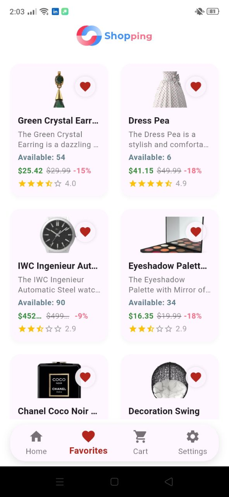
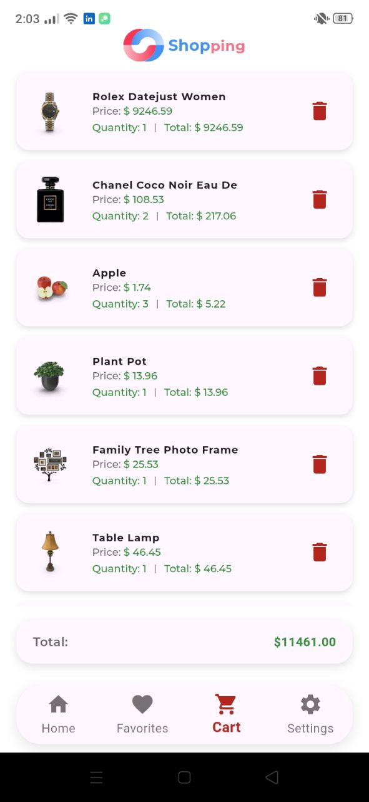

# 🩺 Shopping App


---

<p align="center">
  
</p>

**Shopping App** is a modern mobile application built with Flutter, integrating Firebase Authentication and a powerful API-based product system. Users can browse products, manage favorites, and use a shopping cart with real-time updates.

> This README is structured to help contributors, reviewers, and new developers quickly understand
> and run the project.

---

## 🔑 Highlights

- ✅ Authentication with Firebase 
- ✅ Restful Api
- ✅ Home Page Features
- ✅ Shopping Cart
- ✅ Favorites
- ✅ Theme Support
- ✅Clean & Intuitive UI (Flutter)  
- ✅Secure & Scalable Architecture  


---

## 📸 Screenshots / Preview

> Replace these placeholders with real screenshots from `screenshots/` or `assets/`.

|               Home                     |              Favorite                       |                cart               |
|:--------------------------------------:|:-------------------------------------------:|:------------------------------------:|
|        |   | |

---

## 🏗️ Architecture Overview

```
lib/
├─ core/ # shared services, constants, themes
├─ features/
│ ├─ auth/ # login, register
│ ├─ home/ # product listing, search
│ ├─ cart/ # shopping cart logic
│ ├─ favorites/ # favorite products
│ ├─ categories/ # category listing
├─ widgets/ # reusable UI components
└─ main.dart
```

This layout helps keep features self-contained and easier to test.

---

## 🧩 Tech Stack

- Flutter
- Firebase Auth
- Dio (REST API)
- Cubit (flutter_bloc)
- cached_network_image, image_picker
- Shared Preferences (local storage)
- Optional: CI (GitHub Actions) for build & test

---

## 🎯 Design & UX Decisions

- **Colors & Theming** — centralized in `ColorsManager`, supports Light & Dark themes. Users can toggle between themes seamlessly.
- **Product Cards** — designed for clarity, legibility, and quick scanning. Includes image, name, price, and add-to-cart/favorite buttons.
- **Navigation** — bottom navigation bar with clear icons for Home, Categories, Favorites, Cart, and Profile.
- **Performance** — image caching using `cached_network_image`, lazy loading for product lists, and limited widget rebuilds to reduce UI thrash.
- **Responsiveness** — layouts adapt to different screen sizes and orientations.
- **Animations** — subtle animations for button taps, cart updates, and navigation to improve user experience without overwhelming.
- **Accessibility** — sufficient color contrast, readable fonts, and tappable areas designed according to accessibility guidelines.


---

## 🚀 Getting Started (Developer)

### Prerequisites

- Flutter SDK (stable)
- Android Studio or VS Code

### Quick setup

```bash
# Clone
git clone https://github.com/AzaKhaled/shooping_app.git
cd Medical_Service 

# Install
flutter pub get

# Run
flutter run
```


## 🧪 Testing

- Unit tests: `flutter test`
- Widget/integration tests: `flutter drive` / `integration_test`

Consider adding mocks for Firestore and Auth when writing unit tests.


---

## 🛠️ Common commands

```bash
# Analyze
flutter analyze

# Format
flutter format .

# Run on device
flutter run

# Build
flutter build apk --release
```

---

## 📣 Contributing

1. Fork the repo
2. Create a feature branch
3. Open a PR with description & screenshots

Please follow the existing style and write tests for new logic.

---

## 📬 Contact

azakhaled813@gmail.com


---

*Generated and polished for clarity, structure and developer onboarding.*
